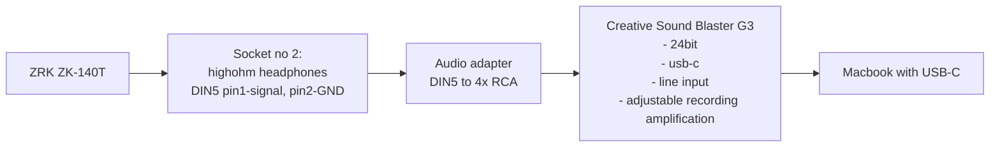

# reel-recordings-digitalisation
Digitalisation of reel tape recordings using Unitra/Grundig ZRK ZK-140T


Plan:

1. - [ ] Design ZRK ZK-140T line adapter
2. - [ ] Build the adapter
3. - [ ] Capture the recordings audio


## ZRK ZK-140T outputs


 

Meaning the amplitude is approximately 4-5V and the output impendance is 51kohm.


## Oscilloscope measurements protocol

```yaml
lab: olsztynek-sportowa31-upperlab
time: 2022-08-14T21:10:00+02:00
```

With:

1. Reel tape player/recorder ZRK ZK-140T
2. Reel tape "Magnetoband, Januray 1975". Side red, channels 1&2
3. Volume setting 7/9
4. Oscilloscope: Rigol DS1052e + probe Jinhao P6100 100Mhz
5. Probe connected to DIN-5 connector no 2 on rear panel, pins 2-gnd, 1-sense.

Got:

1. Audio signal with Vpp=15-30mV


## Recording setup design



