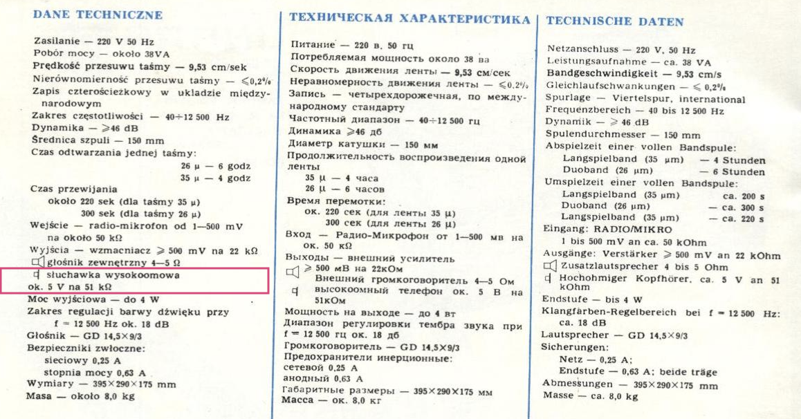
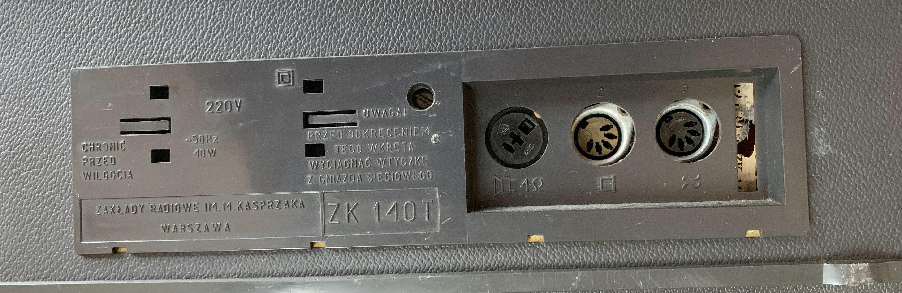
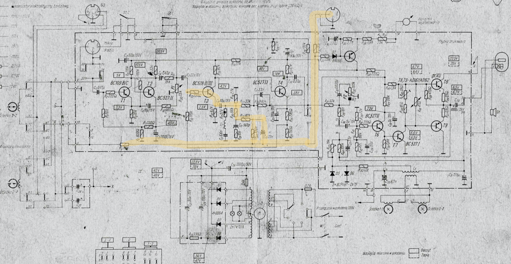

# reel-recordings-digitalisation
Digitalisation of reel tape recordings using Unitra/Grundig ZRK ZK-140T


Plan:

1. - [x] Design ZRK ZK-140T line adapter
2. - [ ] Build the adapter
3. - [ ] Capture the recordings audio


## ZRK ZK-140T outputs






 

Meaning the amplitude is approximately 4-5V and the output impendance is 51kohm.


## Protocol #1: Oscilloscope measurements

```yaml
lab: olsztynek-sportowa31-upperlab
time: 2022-08-14T21:10:00+02:00
```

With:

1. Reel tape player/recorder ZRK ZK-140T
2. Reel tape "Magnetoband, Januray 1975". Side red, channels 1&2
3. Volume setting 7/9
4. Oscilloscope: Rigol DS1052e + probe Jinhao P6100 100Mhz
5. Probe connected to DIN-5 connector no 2 on rear panel, pins 2-gnd, 1-sense.

Got:

1. Audio signal with Vpp=15-30mV


## Protocol #2: Creative sound blaster experiment

```yaml
lab: olsztynek-sportowa31-upperlab
time: 2022-08-23T20:50:00+02:00
```

With:

1. Reel tape player/recorder ZRK ZK-140T

2. Reel tape "Magnetoband, Januray 1975". Side red, channels 1&2

3. Volume setting 9/9 and brightness wheel turned to "speaker sign" (below 1) which turns off internal speaker

4. Below setup:

   ```mermaid
    graph LR
    ZK140T --> Connector2 --> DIN5RCA --> Jack35Adapter --> CreativeDAC --> Macbook
   
    ZK140T["ZRK ZK-140T"]
    Connector2["Socket no 2:<br />highohm headphones<br />DIN5 pin1-signal, pin2-GND"]
    DIN5RCA["Audio adapter<br />DIN5 to 4x RCA"]
    Jack35Adapter["RCA to Jack 3.5mm<br />Connected to <b>Audio OUT-L</b> on RCA"]
    CreativeDAC["Creative Sound Blaster G3<br />- 24bit<br />- usb-c<br />- line input<br />- adjustable recording amplification"]
    Macbook["Macbook with USB-C"]
   ```

5. Software settings:

   1. 24-bit AUX-in recording
   2. Amplification 1.0 = +9dB

6. Recording with Audacity

7. MacBook Pro 2020; disconnected from power adapter and screen

Got:

1. Weak signal (around -30dB ratio to normal audio)
2. 50Hz buzz that was easy to be software removed
3. High-pitch mechanical / electrical noise that was around only -5dB to sound (subjective comparison)


## Improvement ideas

1. Try various RCA-jack cables
2. Try different DIN5-RCA adapter
3. Try different external soundcard
4. Add 51kohm resistive load to match output impendance and prevent high-voltage-low-current noise
