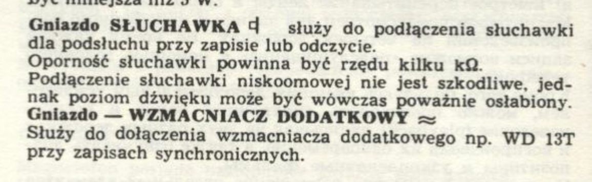

# reel-recordings-digitalisation
Digitalisation of reel tape recordings using Unitra/Grundig ZRK ZK-140T

Plan:

1. - [ ] Design ZRK ZK-140T line adapter
2. - [ ] Build the adapter
3. - [ ] Capture the recordings audio

## ZRK ZK-140T outputs

 

Meaning the amplitude is approximately 4-5V and the output impendance is 51kohm.
